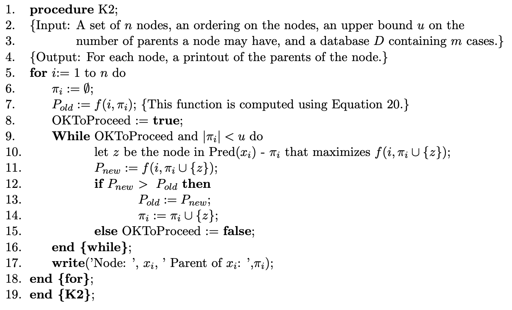

```{r setup, include=FALSE}
knitr::opts_chunk$set(echo = TRUE)
```

## Abstract
A Bayesian belief-network structure is a directed acyclic graph in which nodes represent domain variables and arcs between nodes represent probabilistic dependencies. Such network can be used for descriptive, diagnostic, predictive and prescriptive tasks. An efficient method for determining the relative probabilities of different belief-network structures, given a database of cases and a set of explicit assumptions, is the K2 algorithm. It can be used to learn the topology of a Bayes network, i.e. of finding the most probable belief-network structure, given a database. In this work we implement this algorithm in `R` language for a specific dataset. Furthermore we will use the `bnstruct` `R` package on the same dataset.

## Bayesian belief networks
In order to investigate probabilistic dependencies that exist among variables in a dataset, a useful method is to consider Bayesian belief networks. These are probabilistic graphical models that represents a set of variables (either discrete or continuous) and their conditional dependencies via a directed acyclic graph (DAG). A Bayesian belief network $B$ is made up of a Bayesian belief structure $B_S$ and a set of conditional probabilities between the various nodes $B_P$, and it is denoted as $B=(B_S,B_P)$.

- **Belief structure $B_S$**: it is made up of nodes and edges. Each node represents a variable $x_i$ and the edges are conditional probability functions relating it to its immediate predecessors, called parents and denoted as $\pi_i$, $P(x_i|\pi_i)$. If a node has no parents, then a prior probability $P(x_i)$ is specified.

- **Set of conditional probabilities $B_P$**: it assigns the conditional probabilities over a Bayesian belief structure $B_S$. 

Bayesian belief networks are capable of representing the probabilities over any discrete sample space. In fact, the probability of any sample point in the sample space can be calculated starting from the probabilities in the belief network. In particular the joint probability of any particular instantiation of all $n$ variables in a belief network can be calculated as follows:

$$
P(X_1, \dots, X_n) = \prod_{i=1}^{n} P(X_i|\pi_i)
$$

where $X_i$ represents the instantiation of $x_i$ and $\pi_i$ represents the instantiations of the parents. So, we can compute the complete joint probability space from the belief network reprensentation by calculating the joint probabilities that result from every possible instantiation of the $n$ variables in the network. However, the construction of these networks -- in particular the choice of the structure -- can be very difficult and time-consuming.

### The basic model 
Our task is to find the most probable belief network structure. Let $D$ be a database of cases, $Z$ be the set of variables represented by $D$ and $B_{S_i}$ and $B_{S_j}$ be two possible structures containing exactly those variables that are in $Z$. In order to compare the two structures, we need to compute the ratio

$$
\frac{P(B_{S_i}|D)}{P(B_{S_j}|D)}
$$

which can be rewritten as

$$
\frac{P(B_{S_i}|D)}{P(B_{S_j}|D)} = \frac{\frac{P(B_{S_i},D)}{P(D)}}{\frac{P(B_{S_j},D)}{P(D)}}=\frac{P(B_{S_i},D)}{P(B_{S_j},D)}
$$

Now, the goal is the computation of 

$$
P(B_{S},D) = \int_{B_P} f(D|B_S, B_P)f(B_P|B_S)P(B_S)\, d B_P,
$$

where $f(D|B_S, B_P)$ is the probability density of observing the data given $B$, $f(B_P|B_S)$ is the likelihood of the particular probability assignments and $P(B_S)$ is the prior probability of the structure. In order to compute it, the following assumptions are needed:

- *Assumption 1* The database variables, which we denote as $Z$, are discrete.
- *Assumption 2* Cases occur independently, given a belief network model.
- *Assumption 3* There are no realizations with missing values.
- *Assumption 4* The density function $f(B_P|B_S)$ is uniform.

Thanks to Assumption 1, we can use the probability mass function $P(D|B_S, B_P)$ instead of the density $f(D|B_S, B_P)$. Assumption 2 states that the events are independent, so we can factorize the term $P(D|B_S, B_P)$ as

$$
P(D|B_S, B_P)=\prod_{h=1}^{m}P(C_h|B_S,B_P),
$$

where $C_h$ is the $h$-th case in $D$. So, we can rewrite the equation above as

$$
P(B_S,D)=\int_{B_P} \left[ \prod_{h=1}^{m}P(C_h|B_S,B_P) \right]f(B_P|B_S)P(B_S)\,dB_P.
$$

Now, in order to introduce the main result, we define the following objects. Let:

- $\pi_i$ be list of variables which represent the parents of a node $x_i$;
- $w_{ij}$ be the $j$-th unique instantiation of the values of the variables in $\pi_i$. We say that $w_{ij}$ is an *instantiation* of $\pi_i$;
- $Z$ be a set of $n$ discrete variables, where a variable $x_i$ in $Z$ has $r_i$ possible value assignments $(v_{i1}, ... , v_{ir_i})$;
- $D$ be a database of $m$ cases, where each case contains a value for each variable in $Z$;
- $B_S$ denote a belief network structure containing just the variables in $Z$; 
- $\alpha_{ijk}$ be the number of cases in $D$ in which $x_i$ has the value $v_{ik}$ and $\pi_i$ is instantiated as $w_{ij}$;

> **Theorem.** Assume that $q_i$ are the unique instantiations of $\pi_i$ and define $$N_{ij} = \sum_{k=1}^{r_i} \alpha_{ijk}.$$If Assumptions 1-4 hold, then:$$P(B_S,D)=P(B_S) \prod_{i=1}^{n}\prod_{j=1}^{q_i} \frac{(r_i-1)!}{(N_{ij}+r_i-1)!} \prod_{k=1}^{r_i} \alpha_{ijk}!$$

If we introduce other two assumptions:

- there exists an ordering on the domain variables;
- a priori, all structures are considered equally likely;

then we have

$$
P(B_S,D)=c\prod_{i=1}^{n}\prod_{j=1}^{q_i} \frac{(r_i-1)!}{(N_{ij}+r_i-1)!} \prod_{k=1}^{r_i} \alpha_{ijk}!
$$

where $c$ is the constant prior for each $B_S$. To maximize this equation, we need only to find the parent set of each variable that maximizes the second product. Thus, we have that

$$
\max_{B_S}{P(B_S,D)}=c\prod_{i=1}^{n}\max_{\pi_i}\left[\prod_{j=1}^{q_i} \frac{(r_i-1)!}{(N_{ij}+r_i-1)!} \prod_{k=1}^{r_i} \alpha_{ijk}!\right]. \tag{a}
$$

### A heuristc method: the K2 algorithm
Even if we are able to compute $P(B_S,D)$, if we want to compare all these probabilities we have to compute them all, which is not feasible. So, we introduce a heuristic-search method. The starting point is eq. (a), in which we modify the maximization operation on $\pi_i$ to use a greedy-search method. In particular, we use the K2 algotithm, that begins by making the assumption that a node has no parents and then adds incrementally that parent whose addition most increases the probability of the resulting structure. When the addition of no single parent can increase the probability, we stop adding parents to the node. Let us define the functions

$$
f(i,\pi_i)=\prod_{j=1}^{q_i} \frac{(r_i-1)!}{(N_{ij}+r_i-1)!}\prod_{k=1}^{r_i}\alpha_{ijk}! \tag{b}
$$

and 

$$
\text{Pred}(x_i) = \text{set of nodes that precede } x_i \text{ in the node ordering}.
$$

Then, the structure of the K2 algorithm is the following:

{width=17cm}

## Implementation of the K2 algorithm

Let us consider a specific case in which we have a dataset made of three binary variables, each one with ten cases.

<p align="center">
  
</p>

Our goal is to find which is most probable topology of the Bayesian structure given the increasing index ordering of the variables. 

```{r}
case <- c(1, 2, 3, 4, 5, 6, 7, 8, 9, 10)

x1 <- c(1, 1, 0, 1, 0, 0, 1, 0, 1, 0)
x2 <- c(0, 1, 0, 1, 0, 1, 1, 0, 1, 0)
x3 <- c(0, 1, 1, 1, 0, 1, 1, 0, 1, 0)

data <- data.frame(case, x1, x2, x3)
```

```{r}
n <- ncol(data) - 1 # Number of nodes (x1, x2, x3)
u <- 2 # Upper bound on the number of parents
m <- length(case) # Number of cases 

v <- c(0, 1) # Possible values of x
r <- length(v) # |v|
```

```{r}
# Create all possible combination given a certain number of parents
comb <- function(parent, v) {
  npar <- rep(list(v), length(parent))
  return(expand.grid(npar))
}

comb(c(1,2), v)
```

```{r}
# a_ijk = number of cases (i.e. instances) in D in which the attribute x_i is instantiated with its
#         k-th value, and the parents of x_i in π_i are instantiated with the j-th instantiation in comb(parent,v).
# Input: i = node i, 
#        j = j-th element of comb, 
#        k = index of the value of the node, 
#        data = dataset, 
#        parent = set of parents, 
#        v = possible values of x 

a <- function(i, j, k, data, parent, v) {
  
  if ((length(parent) == 1) & (parent[1] == 0)) { # No parents
    a_out <- length(which(data[, i + 1] == v[k])) 
    return(a_out)
  }
  
  if (length(parent) == 1) { # One parent
    lp <- length(parent) # Number of parents
    combj <- comb(lp, v)[j, ] # j-esim combination of the instantiation of the parents
    
    data_fil_vk <- data[which(data[, i + 1] == v[k]), ] # Select data with x_i = v[k]
    datap <- data_fil_vk[, parent + 1] # Select parents from data
    
    a_out <- length(which(datap == combj))
    return(a_out)
  }
  
  else { # More than one parent
    combj <- comb(parent, v)[j, ] # j-esim combination of the instantiation of the parents
    
    data_fil_vk <- data[which(data[, i + 1] == v[k]), ] # Select data with x_i = v[k]
    datap <- data_fil_vk[, parent + 1] # Select parents from data
    
    a_out <- 0
    for (h in 1:nrow(datap)) { 
      control <- sum(datap[h, ] == combj) # Check if the parents of x_i are instantiated with the j-th comb(parent,v)
      if (control == ncol(datap)) { # If it is true then add 1 to a_out
        a_out <- a_out + 1
      }
    }
    return(a_out)
  }
  
}
```

```{r}
# N_ij = the the number of instances in the database in which the parents of x_i in π_i are 
#        instantiated with the j-th instantiation in comb.

N <- function(i, j, v, data, parent) {
  
  N_out <- 0
  for (k in 1:length(v)) { # Sum over all the possible values of v
    N_out <- N_out + a(i, j, k, data, parent, v)
  }
  return(N_out)
  
}
```

Let us define a function that computes the second product in (b):

$$
\prod_{k=1}^{r_i}\alpha_{ijk}!
$$

```{r}
prod <- function(i, j, data, parent, v) { 
  
  p_out <- 1
  for (k in 1:length(v)) { # Product over all the possible values of v
    p_out <- p_out * factorial(a(i, j, k, data, parent, v))
  }
  return(p_out)
}
```

Finally, we define a function that implements (b):

$$
f(i,\pi_i)=\prod_{j=1}^{q_i} \frac{(r_i-1)!}{(N_{ij}+r_i-1)!}\prod_{k=1}^{r_i}\alpha_{ijk}!
$$

```{r}
# f = probability of the database D given that the parents of x_i are π_i

f <- function(i, data, parent, v, r) {
  
  p_j <- 1 
  
  if ((length(parent) == 1) & (parent[1] == 0)) { # No parents: ignore the first product and j
    p_j <- (factorial(r - 1) / factorial(N(i, 1, v, data, parent) + r - 1)) * prod(i, 1, data, parent, v)
    return(p_j)
  }
  
  if (length(parent) == 1) { # One parent: j can be only 1 or 2
    for (j in 1:r) {
      p_j <- p_j * (factorial(r - 1) / factorial(N(i, j, v, data, parent) + r - 1)) * prod(i, j, data, parent, v)
    }
    return(p_j)
  }
  
  else { # More than one parent: j goes from 1 to 2^{number of parents}
    for (j in 1:(2^length(parent))) {
      p_j <- p_j * (factorial(r - 1) / factorial(N(i, j, v, data, parent) + r - 1)) * prod(i, j, data, parent, v)
    }
    return(p_j)
  }
  
}
```

#### K2 algorithm

```{r}
K2 <- function(data) {
  
  n <- ncol(data) - 1 # Number of nodes (x1, x2, x3)
  u <- 2 # Upper bound on the number of parents
  v <- c(0, 1) # Possible values of x
  r <- length(v)
  parents.list <- NULL
  
  for (i in 1:n) { # Loop over the (ordered) nodes
    
    # Initial values
    parent <- 0 
    p_old <- f(i, data, parent, v, r)
    OKToProceed <- TRUE
    
    cat("-------------- Node:", i, "\n")
    cat("P_old =", p_old, "\n")
    
    if (i == 1) { # First node has no parents
      OKToProceed <- FALSE
    }
    
    pred <- 1:(i - 1) # Indexes of predecessors
    
    while ((OKToProceed == TRUE) & (length(parent) < u)) {
    
      p_h <- c() # Set of candidate values of P_new (f)
      
      #### Add the candidate parents and compute f for them ####
      for (h in pred) {
        
        if ((length(parent) == 1) & (parent[1] == 0)) { # No current parents
          candidate_h <- h 
        }
        
        else { # Add the predecessors to the current parents
          candidate_h <-  c(parent, h)
          candidate_h <- sort(candidate_h, decreasing = FALSE)
        }
        
        p_h <- c(p_h, f(i, data, candidate_h, v, r)) # Compute f for all the possible parents
      }
      
      #### Find the parents by considering the maximum value of f ####
      if ((length(parent) == 1) & (parent[1] == 0)) { # No parents
        candidate <- pred[which.max(p_h)]
      }
      
      else { # Parents
        candidate <-  c(parent, pred[which.max(p_h)])
        candidate <- sort(candidate, decreasing = FALSE) 
      }
      
      p_new <- max(p_h) # Find P_new = max{f}
      
      cat("P_new =", p_new, "\n")
      
      if (p_old < p_new) { # If P_new > P_old, update P and parent
        p_old <- p_new
        parent <- candidate
        pred <- pred[-c(parent)]
        pred <- sort(pred, decreasing = FALSE)
      }
      
      else {
        OKToProceed <- FALSE
      }
      
      if (length(pred) == 0) { # If there are no more predecessors, end the while loop
        OKToProceed <- FALSE
      }
    }
    cat("Node:", i, ", parents:", parent, "\n \n")
    parents.list <- c(parents.list, parent)
  }
  return(parents.list)
}
```

```{r}
K2(data)
```

## The `bnstruct` package

Now, we consider the `bnstruct` package, an open source `R` package, which is able to learn the structure and the parameters of a Bayesian Network from data -- also in the presence of missing values -- and to perform reasoning and inference on the learned Bayesian Networks. 

The package implements five algorithms:

- the Silander-Myllymaki complete search, that performs a complete evaluation of the search space. This algorithm may take a very long time, and can be inapplicable when discovering networks with more than 25–30 nodes; 
- the Max-Min Parents-and-Children, a constraint-based heuristic approach that discovers the set of edges connecting the variables without discovering their directionality;
- the Hill-Climbing, an heuristic algorithm;
- the Max-Min Hill-climbing heuristic searches, based on the combination of the previous two algorithms, that performs a statistical sieving of the search space followed by a greedy evaluation;
- the Structural Expectation-Maximization algorithm, used for learning a network from a dataset with missing values.

To compute the posterior probability distribution $P(B_S|D)$, starting from a prior probability distribution $P(B_S)$ on the possible networks, different scoring functions are available: BDeu (Bayesian-Dirichlet equivalent uniform, default), AIC (Akaike Information Criterion), BIC (Bayesian Information Criterion). The package also implements methods for generating and using bootstrap samples, imputed data, inference.

We use this package to learn the topology of the same dataset introduced above and see if we find the same result. Then, we also implement a function to interface our K2 algorithm with the package. 

### Define the BNDataset
```{r, include=FALSE}
#if (!requireNamespace("BiocManager", quietly = TRUE))
#    install.packages("BiocManager")

#BiocManager::install("graph")
library(bnstruct)
library(graph)
```

```{r}

x1 <- c(1, 1, 0, 1, 0, 0, 1, 0, 1, 0)
x2 <- c(0, 1, 0, 1, 0, 1, 1, 0, 1, 0)
x3 <- c(0, 1, 1, 1, 0, 1, 1, 0, 1, 0)

data <- matrix(c(x1, x2, x3), byrow = FALSE, nrow = length(x1))

dataset.from.data <- BNDataset(data = data, # Data
                               discreteness = c('d', 'd', 'd'), # State of the variables (d = discrete)
                               variables = c("x1", "x2", "x3"), # Names of the variables 
                               algo = "sm", # Silander-Myllymaki complete search algorithm
                               node.sizes = c(2,2,2), # Cardinalities of the variables
                               starts.from = 0, # Specify that the variable values start from 0 
                                                # (by default they start from 1) 
                               num.time.steps = 3) # Number of instants that compose the dataset

raw.data(dataset.from.data) # Visualize (raw) data
```

### Learn the network using the `bnstruct` `sm` algorithm
```{r}
net <- learn.network(dataset.from.data) # learn the network (DAG) that may have generated the dataset

dag(net) # Access the structure of the network

plot(net) # Plot the learned network
```

### Test on `Asia` dataset

Dyspnoea may be due to tuberculosis, lung cancer or bronchitis, or none of them, or more than one of them. A recent visit to Asia increases the chances of tuberculosis, while smoking is known to be a risk factor for both lung cancer and bronchitis. The results of a single chest X-ray do not discriminate between lung cancer and tuberculosis, as neither does the presence or absence of dyspnoea.

#### Learning without bootstrap
```{r}
data <- asia()

net <- learn.network(data) 

plot(net)
```

#### Learning with bootstrap
```{r}
data <- asia()

dataB <- bootstrap(data, num.boots = 100)

net <- learn.network(dataB, bootstrap = TRUE)

plot(net)
```

### Learning the network using the K2 algorithm
```{r}
learn.network.K2 <- function(dataset.from.data) {
  
  data <- as.data.frame(raw.data(dataset.from.data)-1) # retrieve the original dataset
  cases <- seq(1, nrow(data)) 
  data <- cbind(cases, data)
  
  parents <- K2(data) # use the K2 algorithm
  parents.mat <- matrix(0L,length(parents),length(parents)) # initialize the adjacency matrix
  
  for(i in 1:nrow(parents.mat)) { # fill the adjacency matrix with ones in the position 
                                  # corresponding to the parents of each node
    for(j in 1:ncol(parents.mat)) {
      if(j==parents[i]) { parents.mat[j,i] <- 1 }
    }
  }
  net <- BN(dataset.from.data) # create the Bayesian Network
  net@dag <- parents.mat # use the adjacency matrix as DAG of the net
  return(net)
}

net <- learn.network.K2(dataset.from.data) 

dag(net) # Access the structure of the network

plot(net) # Plot the learned network
```

## A full implementation
The code of the package is available on [GitHub](https://github.com/sambofra/bnstruct). For a full implementation, one should add the the function of the K2 algorithm in the file `learn-methods.R` and a dedicated `K2.R` file. 

## Bibliography
[1] G. F. Cooper and E. Herskovits, *A Bayesian Method for the Induction of Probabilistic Networks from Data*, Machine Learning 9, (1992) 309

[2] C. Ruiz, *Illustration of the K2 Algorithm for learning Bayes Net Structures*, http://web.cs.wpi.edu/~cs539/s11/Projects/k2_algorithm.pdf

[3] A. Franzin et al., *bnstruct: an R package for Bayesian Network structure learning in the presence of missing data*, Bioinformatics 33(8) (2017) 1250

[4] F. Sambo and A. Franzin, *bnstruct: an R package for Bayesian Network Structure Learning with missing data*, December 12, 2016

[5] S. L. Lauritzen and D. J. Spiegelhalter, *Local Computations with Probabilities on Graphical Structures and Their Application to Expert Systems*, Journal of the Royal Statistical Society. Series B (Methodological), Vol. 50, No. 2 (1998), 157-224